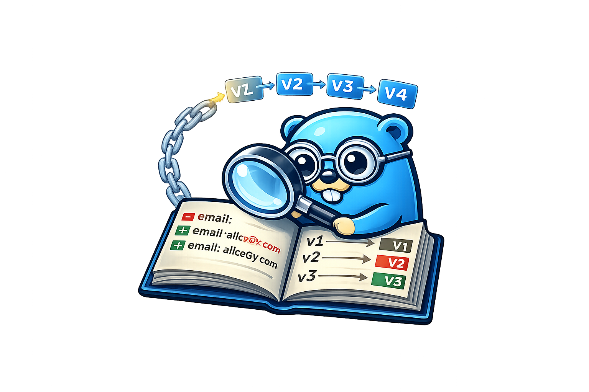

# go-audit

<p align="center">
  
</p>

<p align="center">
  <strong>A versioning and audit trail library for Go applications.</strong><br/>
  Track every change to your domain entities — with diffs, metadata, and queryable history.
</p>

<p align="center">
  <a href="https://github.com/abhipray-cpu/go-audit/actions/workflows/ci.yml"></a>
  <a href="https://pkg.go.dev/github.com/abhipray-cpu/go-audit"></a>
  <a href="LICENSE"></a>
</p>

---

## Why go-audit?

Every non-trivial application eventually needs to answer *"what changed, when, and by whom?"* — whether for compliance, debugging, or building undo. **go-audit** solves this in a single library call:

```go
pending, _ := auditor.Version(ctx, &user)
```

The library handles diffing, serialization, metadata capture, and persistence — you just register your entities and call `Version()`.

## Install

```bash
go get github.com/abhipray-cpu/go-audit
```

Requires **Go 1.21+**. The core module has **zero external dependencies** beyond the standard library.

## Quick Start

```go
package main

import (
    "context"
    "fmt"
    "log"

    audit "github.com/abhipray-cpu/go-audit"
    "github.com/abhipray-cpu/go-audit/domain"
    audittest "github.com/abhipray-cpu/go-audit/testing"
)

type User struct {
    ID    string `version:"id"`
    Name  string `version:"tracked"`
    Email string `version:"tracked"`
}

func main() {
    store := audittest.NewInMemoryStore()

    auditor, err := audit.New(audit.Config{Writer: store, Reader: store})
    if err != nil {
        log.Fatal(err)
    }
    defer auditor.Shutdown(context.Background())

    auditor.Register(&User{})

    ctx := audit.WithActor(context.Background(), "user-123", domain.ActorHuman)
    ctx = audit.WithReason(ctx, "profile update")

    user := &User{ID: "u1", Name: "Alice", Email: "alice@example.com"}
    pending, err := auditor.Version(ctx, user)
    if err != nil {
        log.Fatal(err)
    }

    result, _ := pending.Wait(ctx)
    fmt.Printf("v%d %s/%s\n", result.Version, result.EntityType, result.EntityID)

    latest, _ := auditor.GetLatest(ctx, "user", "u1")
    fmt.Printf("Latest: v%d\n", latest.Version)
}
```

## Features

| Category | What you get |
|----------|-------------|
| **Diffing** | Field-level change detection for structs, maps, slices, and nested JSON |
| **Context** | Actor, reason, and correlation ID attached automatically via `context.Context` |
| **Strategies** | Full snapshot, delta-only, or hybrid (snapshot every Nth version) |
| **Transactions** | `VersionInTx()` participates in your existing DB transaction |
| **Hash chain** | Optional SHA-256 tamper-evident integrity verification |
| **Schema evolution** | `RegisterMigration()` for transparent data transforms across struct changes |
| **Redaction** | `version:"redacted"` tag for GDPR-compliant PII masking |
| **Background** | Async worker pool with Write-Ahead Log for crash recovery |
| **Hooks** | Before-read and before-write lifecycle callbacks for authorization |
| **Multi-tenancy** | Tenant-scoped isolation via context |
| **Cold storage** | Archive old versions to S3 or GCS with Zstandard compression |
| **Testing** | In-memory store + assertion helpers — zero config |

## Entity Tags

```go
type Order struct {
    ID     string  `version:"id"`       // unique identifier (required)
    Status string  `version:"tracked"`  // included in diffs
    Amount float64 `version:"tracked"`
    Secret string  `version:"redacted"` // stored as "[REDACTED]"
    Cache  string  `version:"ignore"`   // excluded entirely
}
```

## Storage Backends

| Backend | Module | Role |
|---------|--------|------|
| PostgreSQL | `adapter/postgres` | Primary OLTP (pgx/v5) |
| MySQL | `adapter/mysql` | Primary OLTP (InnoDB, utf8mb4) |
| ClickHouse | `adapter/clickhouse` | OLAP analytics (ReplacingMergeTree) |
| S3 | `adapter/coldstore/s3` | Cold archive (Zstandard compressed) |
| GCS | `adapter/coldstore/gcs` | Cold archive (configurable compression) |
| In-memory | `testing/` | Unit tests (thread-safe, zero-config) |

Each backend lives in its own Go sub-module — import only what you use.

## Recipes

**Hybrid snapshots** — full snapshot every 10th version, deltas in between:

```go
audit.Config{
    Strategy:               domain.StrategyHybrid,
    HybridSnapshotInterval: 10,
}
```

**Hash chain integrity** — tamper-evident audit trail:

```go
auditor, _ := audit.New(audit.Config{
    Writer:          store,
    Reader:          store,
    EnableHashChain: true,
    Hasher:          hash.NewSHA256(),
})
err := auditor.VerifyIntegrity(ctx, "order", "order-123")
```

**Transactional versioning** — atomic with your business write:

```go
result, err := auditor.VersionInTx(ctx, tx, updatedUser)
```

**Write-Ahead Log** — crash recovery for background writes:

```go
audit.Config{WALDir: "/var/lib/go-audit/wal"}
```

**Testing** — zero-config auditor for unit tests:

```go
func TestMyService(t *testing.T) {
    auditor, store := audittest.NewAuditor(t)
    auditor.Register(&User{})

    // ... exercise your code ...

    audittest.AssertVersionCount(t, store, "user", "u1", 3)
}
```

## Documentation

| | |
|---|---|
| **[Usage Guide](docs/usage.md)** | Step-by-step integration with all features |
| **[Architecture](docs/ARCHITECTURE.md)** | Hexagonal design, data flows, ADRs |
| **[API Reference](https://pkg.go.dev/github.com/abhipray-cpu/go-audit)** | Generated Go documentation |
| **[Examples](examples/)** | 8 runnable examples covering common patterns |
| [Changelog](CHANGELOG.md) | Release history |
| [Contributing](CONTRIBUTING.md) | Dev workflow and code style |
| [Security](SECURITY.md) | Vulnerability reporting |

## License

[Apache 2.0](LICENSE)
