# `go-audit` — Architecture Document

> **Status**: Final  
> **Date**: 2026-02-10  
> **Authors**: Engineering Team  
> **Language**: Go (minimum 1.21)

---

## Table of Contents

1. [What Is go-audit?](#1-what-is-go-audit)
2. [Design Principles](#2-design-principles)
3. [Architecture at a Glance](#3-architecture-at-a-glance)
   - [3.1 High-Level Overview](#31-high-level-overview)
   - [3.2 Hexagonal Architecture](#32-hexagonal-architecture)
   - [3.3 Dependency Rule](#33-dependency-rule)
4. [The Diff Engine — Our Core Differentiator](#4-the-diff-engine--our-core-differentiator)
5. [Storage Profiles](#5-storage-profiles)
   - [5.1 Simple Profile](#51-simple-profile-oltp-only)
   - [5.2 Recommended Profile](#52-recommended-profile-oltp--olap--cold)
6. [Ports & Adapters](#6-ports--adapters)
   - [6.1 Inbound Ports](#61-inbound-ports-driving)
   - [6.2 Outbound Ports — Overview](#62-outbound-ports-overview)
   - [6.3 Outbound Ports — Detailed Map](#63-outbound-ports-detailed-map)
7. [How Data Flows](#7-how-data-flows)
   - [7.1 Write Path — Hot Path + Background Worker](#71-write-path--hot-path--background-worker)
   - [7.2 Read Path — Tiered Query Routing](#72-read-path--tiered-query-routing)
   - [7.3 Transaction-Aware Versioning](#73-transaction-aware-versioning)
8. [Schema Ownership](#8-schema-ownership)
   - [8.1 Why the Library Owns the Schema](#81-why-the-library-owns-the-schema)
   - [8.2 OLTP Schema](#82-oltp-schema)
   - [8.3 OLAP Schema](#83-olap-schema)
   - [8.4 Schema Evolution](#84-schema-evolution)
9. [Write-Ahead Log (WAL)](#9-write-ahead-log-wal)
10. [Entity Guardrails](#10-entity-guardrails)
11. [Non-blocking Pipeline](#11-non-blocking-pipeline)
12. [Failure Modes & Resilience](#12-failure-modes--resilience)
13. [Observability](#13-observability)
14. [Security](#14-security)
15. [Package Layout](#15-package-layout)
16. [Architecture Decision Records](#16-architecture-decision-records)
17. [Open Decisions](#17-open-decisions)
18. [Appendix A: Version Record Schema](#appendix-a-version-record-schema)
19. [Appendix B: Quick-Start Examples](#appendix-b-quick-start-examples)
20. [Appendix C: Testing Support](#appendix-c-testing-support)
21. [Appendix D: Gap Analysis](#appendix-d-gap-analysis)

---

## 1. What Is go-audit?

`go-audit` is a **single-purpose Go library** that does exactly one job: **maintain version history and audit trails for arbitrary Go entities**.

```go
// That's it — three lines to get started
auditor := audit.New(audit.Config{DB: db})
auditor.Register(&User{})
pending, _ := auditor.Version(ctx, user)
```

**What it does:**

- Captures entity state changes as immutable version records
- Computes intelligent diffs — including deeply nested JSON, maps, slices, and arbitrary Go structs
- Stores versions in library-managed, optimized schemas
- Reconstructs entity state at any point in time
- Handles entity schema evolution transparently
- Provides structured audit metadata (who, what, when, why)
- Survives process crashes without data loss (opt-in WAL)

**What it does NOT do:**

- Provide a REST API or UI
- Replace event sourcing
- Enforce authorization (but provides hooks)
- Bundle any specific OTEL exporter or message broker

---

## 2. Design Principles

| # | Principle | What It Means |
|---|-----------|---------------|
| 1 | **Single Responsibility** | Version & audit. Nothing else. |
| 2 | **Library, Not Framework** | No hidden goroutines, no global state, no `init()` side effects. |
| 3 | **Opinionated Defaults** | Two storage profiles. Library-managed schemas. Override only when you must. |
| 4 | **Library Owns Its Schema** | Every table, index, partition, and migration is library-defined. A bad schema = catastrophic perf. |
| 5 | **Never Block the Business** | Default mode returns in ~1ms. Versioning failure never impacts caller operations. |
| 6 | **Hexagonal Architecture** | Domain core depends on port interfaces only. Swap any adapter without touching domain logic. |
| 7 | **Crash Durability (Opt-in)** | Three WAL adapters (Noop, File, DB) cover VMs, K8s, serverless, and multi-pod. |
| 8 | **Context is King** | All metadata flows through `context.Context`. No thread-local magic. |

---

## 3. Architecture at a Glance

### 3.1 High-Level Overview

This is how `go-audit` fits into your application. The library is embedded — no new services to deploy.

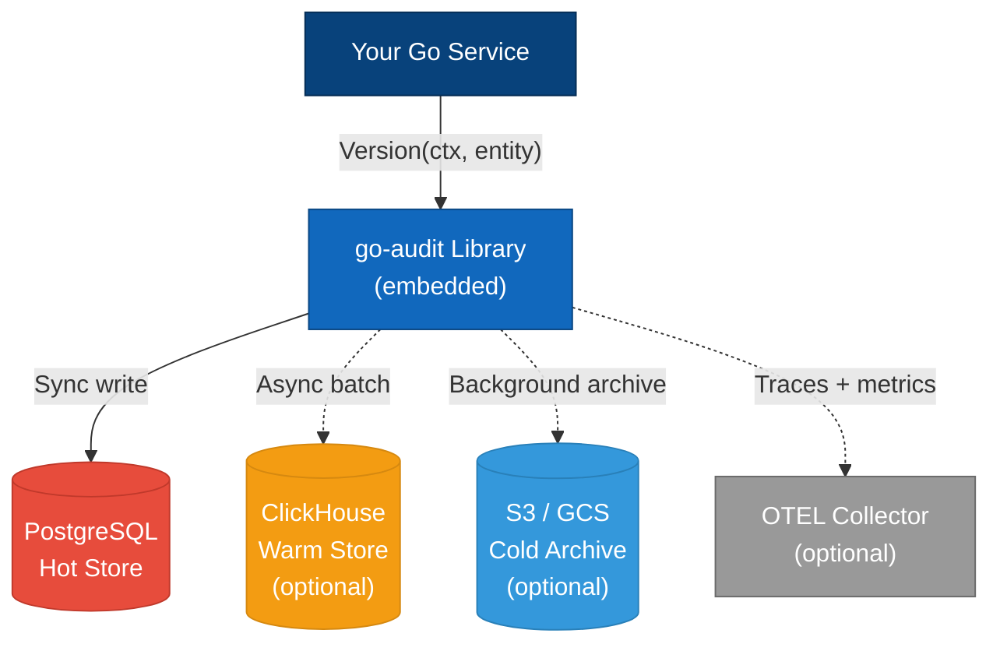

### 3.2 Hexagonal Architecture

The library is structured as a **hexagonal (ports & adapters)** system. The domain core contains zero infrastructure imports — it speaks only through interfaces (ports). Adapters implement those interfaces for specific infrastructure.

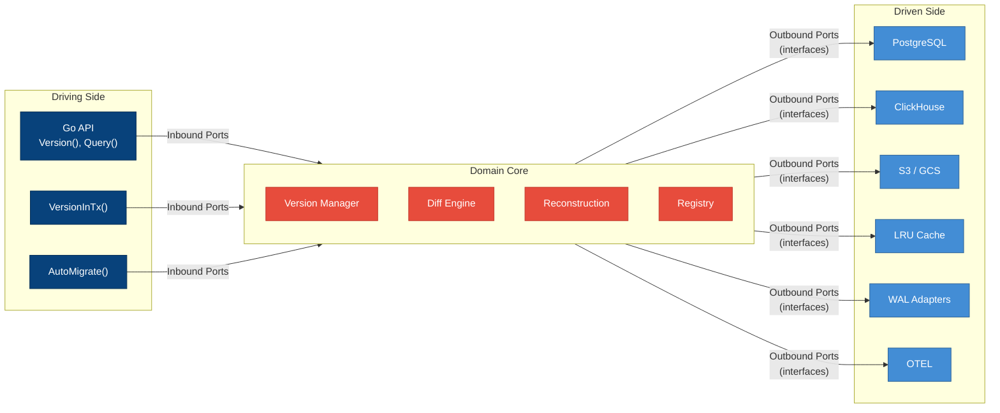

**Why this matters:** You can swap PostgreSQL for MySQL, S3 for GCS, or OTEL for Datadog — all by changing the adapter, never the domain logic.

### 3.3 Dependency Rule

```
    ┌────────────────────────────────────────────┐
    │  Adapters  (PostgreSQL, ClickHouse, OTEL)  │
    │                                            │
    │   ┌────────────────────────────────────┐   │
    │   │  Ports  (interfaces in domain/)    │   │
    │   │                                    │   │
    │   │   ┌────────────────────────────┐   │   │
    │   │   │  Domain Core               │   │   │
    │   │   │  Pure Go + stdlib only      │   │   │
    │   │   │  Zero infrastructure deps   │   │   │
    │   │   └────────────────────────────┘   │   │
    │   │                                    │   │
    │   └────────────────────────────────────┘   │
    │                                            │
    └────────────────────────────────────────────┘

    Direction: Adapters → Ports → Domain (never reversed)
```

---

## 4. The Diff Engine — Our Core Differentiator

The diff engine is the heart of `go-audit`. It computes the delta between two entity states — and unlike naive `reflect.DeepEqual` comparisons, it handles **real-world Go data** correctly and efficiently.

### What Makes It Hard

Most diff libraries break on nested, heterogeneous data. Audit trails operate on arbitrary team-defined structs — not clean, flat DTOs. The engine must handle all of the following:

| Data Shape | Challenge | Our Approach |
|-----------|-----------|-------------|
| **Flat structs** | Trivial — field-by-field comparison | Direct comparison, O(fields) |
| **Nested structs** (5+ levels) | Recursive traversal, path tracking | Recursive walk with dot-notation paths (`address.city`) |
| **Slices / arrays** | Order-dependent, insertions shift indices | Element-wise diff with positional tracking |
| **Maps** (`map[string]any`) | Key ordering is non-deterministic | Key-sorted comparison, key added/removed/changed |
| **Pointers** | Nil vs zero-value ambiguity | Dereference before compare, nil-aware |
| **Embedded structs** | Promoted fields appear at multiple levels | Flatten promoted fields, deduplicate |
| **`interface{}` / `any` fields** | Runtime type varies per instance | Type-switch dispatch, deep comparison of underlying values |
| **Nested JSON (serialized as `map[string]any`)** | Arbitrary depth, mixed types at each level | Recursive map walker with type-aware leaf comparison |
| **`time.Time`** | Nanosecond precision, timezone normalization | `.Equal()` instead of `==`, UTC normalization |
| **Custom types** | `type Status int` with methods | Underlying type comparison + optional `DiffEqual` interface |

### Architecture of the Diff Engine

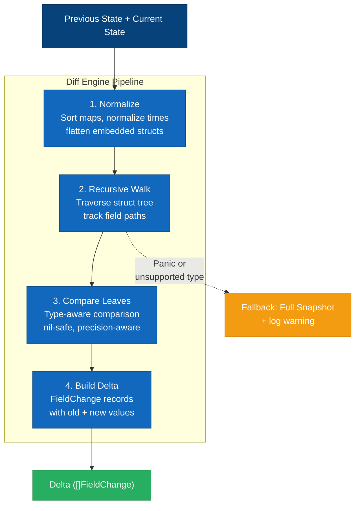

### Example: Nested JSON Diff

```go
type Config struct {
    ID       string                 `version:"id"`
    Settings map[string]interface{} `version:"tracked"`
}

// Version 1
v1 := Config{
    ID: "cfg-1",
    Settings: map[string]interface{}{
        "theme": "dark",
        "notifications": map[string]interface{}{
            "email": true,
            "sms":   false,
        },
    },
}

// Version 2 — nested change
v2 := Config{
    ID: "cfg-1",
    Settings: map[string]interface{}{
        "theme": "light",                          // changed
        "notifications": map[string]interface{}{
            "email": true,
            "sms":   true,                         // changed (nested)
            "push":  true,                         // added (nested)
        },
        "language": "en",                          // added
    },
}

// Diff engine produces:
// FieldChange{Path: "Settings.theme",                  Old: "dark",  New: "light"}
// FieldChange{Path: "Settings.notifications.sms",      Old: false,   New: true}
// FieldChange{Path: "Settings.notifications.push",     Old: nil,     New: true}
// FieldChange{Path: "Settings.language",                Old: nil,     New: "en"}
```

### Graceful Degradation (ADR-005)

If the diff engine encounters an unsupported type or panics during comparison:

1. **Catch** — recover from panic
2. **Fallback** — store a full snapshot instead of a delta
3. **Log** — emit a structured warning via `LoggerPort`
4. **Metric** — increment `audit.diff.fallback` counter
5. **Never persist a delta that can't reconstruct** — validation runs in the worker pool (off the hot path) to verify `Apply(previous, delta) == current`

### The `DifferPort` Interface

Teams can replace the built-in `StructDiffer` with a custom implementation (e.g., JSON Patch, domain-specific diff logic):

```go
type DifferPort interface {
    Diff(ctx context.Context, previous, current any) (Delta, error)
    Apply(ctx context.Context, base any, delta Delta) (any, error)
    Supports(entityType string) bool
}
```

---

## 5. Storage Profiles

Instead of arbitrary storage backends, the library offers **two opinionated profiles**. Teams pick one — the library handles schema, indexes, tiering, and query routing.

### 5.1 Simple Profile (OLTP Only)

**Best for**: Getting started, <1M versions, small-to-medium workloads.

```go
auditor := audit.New(audit.Config{DB: db})
```

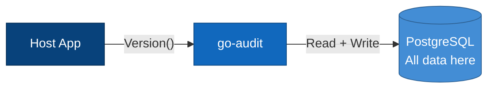

| Aspect | Detail |
|--------|--------|
| Point query | 1–5ms |
| Aggregation | 500ms–5s (acceptable for <10M rows) |
| Schema | Auto-created by `audit.AutoMigrate(db)` |

### 5.2 Recommended Profile (OLTP + OLAP + Cold)

**Best for**: >1M versions, compliance, analytics, high-volume services.

```go
auditor := audit.New(audit.Config{
    DB:        db,       // PostgreSQL — hot (last 90 days)
    OLAP:      chDB,     // ClickHouse — warm (last 2 years)
    ColdStore: s3Store,  // S3 — cold (2+ years, compressed)
})
```

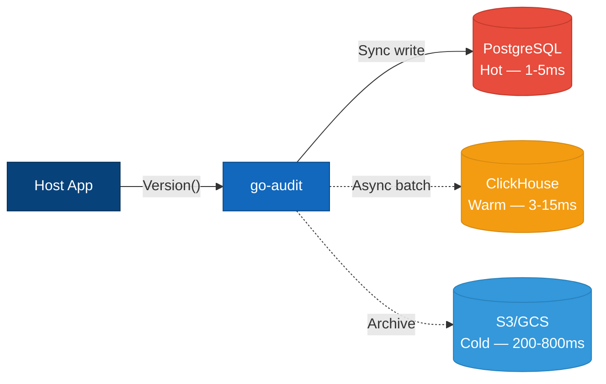

**Why ClickHouse over Snowflake?** ClickHouse is open-source, self-hostable, and the majority choice for real-time OLAP among Go/backend teams. Snowflake is a managed cloud-only data warehouse — great for BI, but adds vendor lock-in and latency for point queries. Since the library uses the `OLAPPort` interface, a Snowflake adapter can be built by any team that needs it — but it's not a default because most teams don't need it.

### Query Performance Comparison

| Query | Simple (OLTP only) | Recommended (OLTP + OLAP) |
|-------|-------------------|--------------------------|
| Get version 42 of user_123 | 1–5ms | 1–5ms (recent) / 3–15ms (historical) |
| List all versions of user_123 | 2–10ms | 2–15ms |
| Aggregations (changes/day, 90d) | 500ms–5s | 100–500ms |
| Cold archive lookup | N/A | 200–800ms |

---

## 6. Ports & Adapters

### 6.1 Inbound Ports (Driving)

These are the interfaces your application calls:

```go
// How callers create versions
type VersioningPort interface {
    Version(ctx context.Context, entity any, opts ...VersionOption) (PendingVersion, error)
    VersionInTx(ctx context.Context, tx Transaction, entity any) (VersionRecord, error)
}

// How callers query versions
type QueryPort interface {
    GetVersion(ctx context.Context, entityType, entityID string, version int64) (VersionRecord, error)
    GetLatest(ctx context.Context, entityType, entityID string) (VersionRecord, error)
    GetAtTime(ctx context.Context, entityType, entityID string, t time.Time) (VersionRecord, error)
    ListVersions(ctx context.Context, entityType, entityID string, opts ...ListOption) ([]VersionRecord, error)
    Compare(ctx context.Context, entityType, entityID string, v1, v2 int64) (Delta, error)
    FindChanges(ctx context.Context, entityType, entityID, fieldName string, opts ...ListOption) ([]FieldChange, error)
    FindByActor(ctx context.Context, actorID string, opts ...ListOption) ([]VersionRecord, error)
    GetBulkAtTime(ctx context.Context, entityType string, entityIDs []string, t time.Time) (map[string]VersionRecord, error)
}

// How callers trigger migrations
type SchemaPort interface {
    Migrate(ctx context.Context) error
    Validate(ctx context.Context) error
}
```

### 6.2 Outbound Ports — Overview

The domain core interacts with infrastructure **only** through these 15 outbound port interfaces. Each port has a single responsibility:

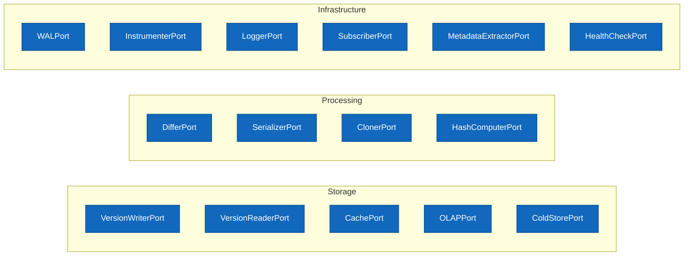

### 6.3 Outbound Ports — Detailed Map

Each port maps to one or more concrete adapters. Library-shipped adapters cover common cases; teams implement custom adapters for their specific infrastructure.

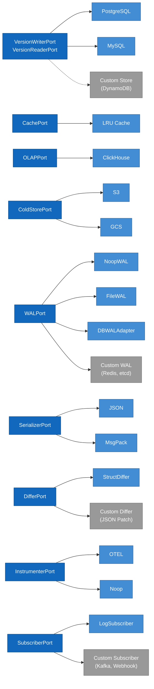

| Port | Purpose | Built-in Adapters |
|------|---------|-------------------|
| `VersionWriterPort` | Write version records | PostgreSQL, MySQL |
| `VersionReaderPort` | Read version records | PostgreSQL, MySQL |
| `CachePort` | In-memory caching | LRU Cache |
| `OLAPPort` | Batch write + analytics | ClickHouse |
| `ColdStorePort` | Compressed archive | S3, GCS |
| `WALPort` | Write-ahead log | NoopWAL, FileWAL, DBWALAdapter |
| `DifferPort` | Compute diffs | StructDiffer |
| `SerializerPort` | Marshal/unmarshal | JSON, MsgPack |
| `ClonerPort` | Deep-copy entity | ReflectCloner |
| `InstrumenterPort` | Observability | OTEL (separate module), Noop |
| `SubscriberPort` | Post-write notification | LogSubscriber |
| `MetadataExtractorPort` | Extract audit context | ContextExtractor, HTTP, gRPC |
| `LoggerPort` | Structured logging | slog adapter |
| `HashComputerPort` | Hash chain (opt-in) | SHA-256 |
| `HealthCheckPort` | Backend health | Built-in checker |

---

## 7. How Data Flows

### 7.1 Write Path — Hot Path + Background Worker

The write path is split into two stages: a **hot path** (~1ms on the caller's goroutine) and a **background worker** (off the caller's goroutine).

**Hot Path** — the only code blocking your application:

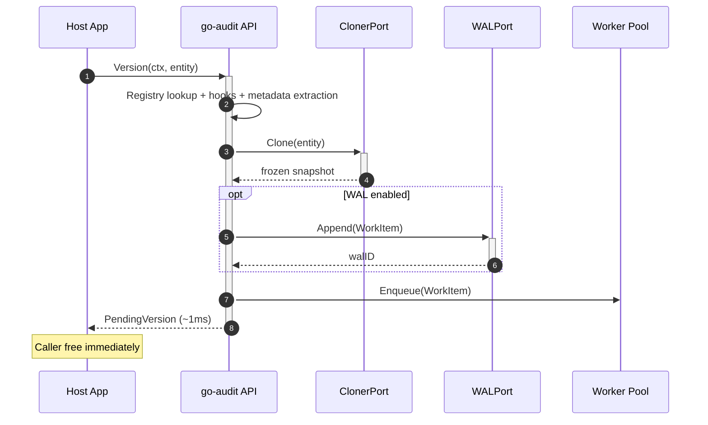

**Background Worker** — runs in a bounded goroutine pool:

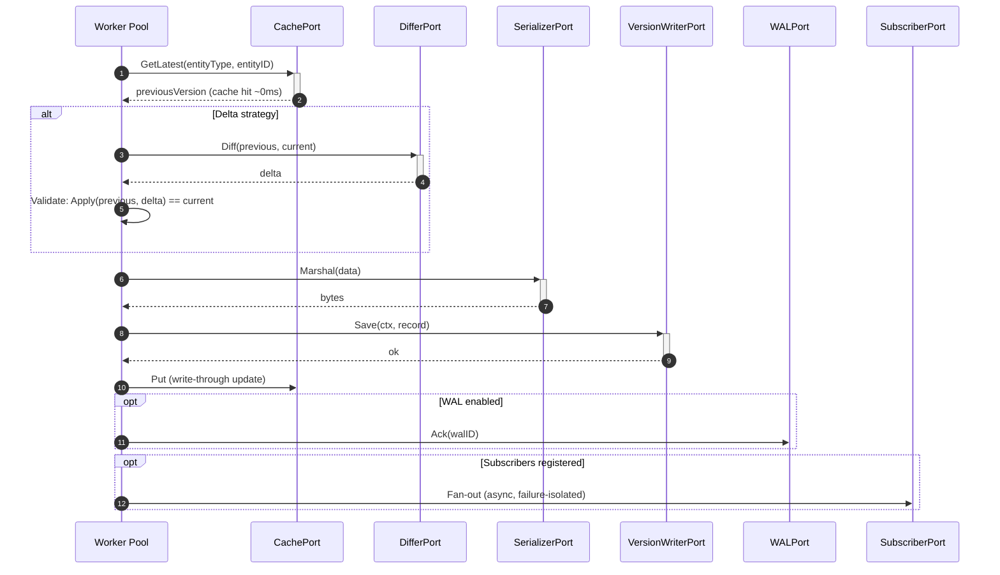

### 7.2 Read Path — Tiered Query Routing

The query engine automatically routes reads to the correct storage tier:

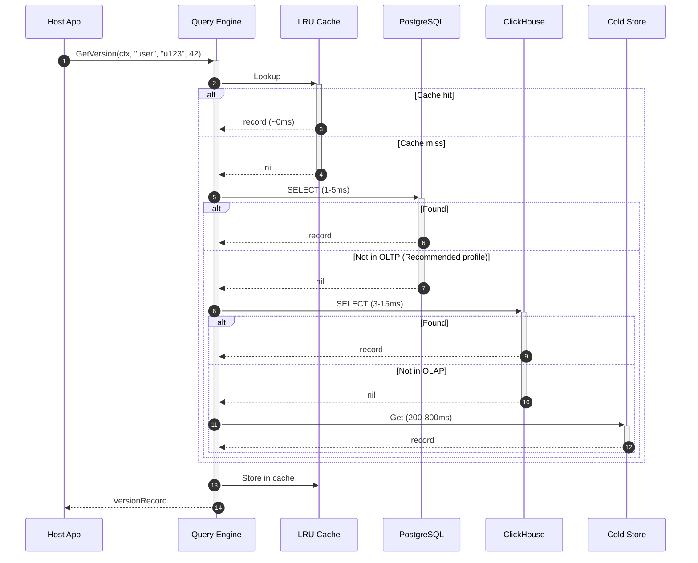

**State reconstruction from deltas** — when the requested version is stored as a delta:

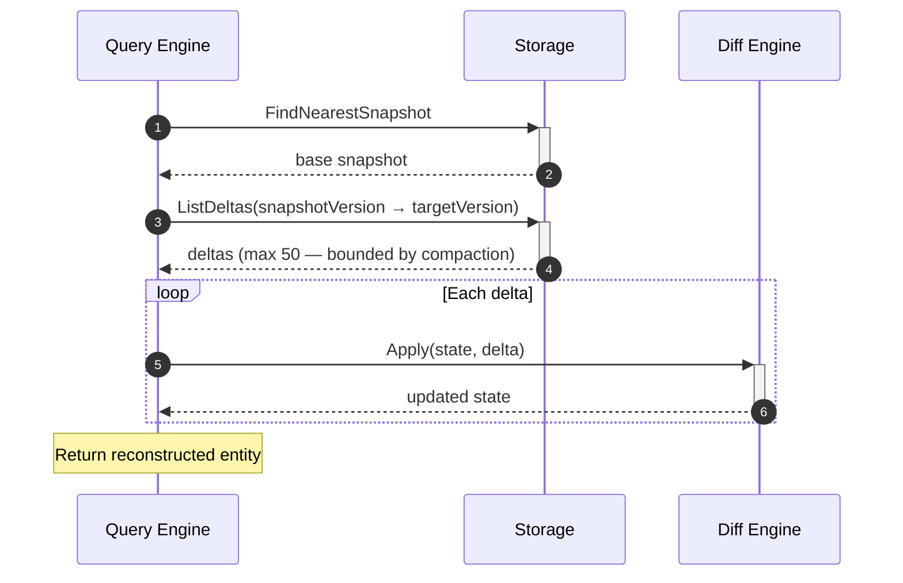

### 7.3 Transaction-Aware Versioning

When the version must be atomic with a business write:

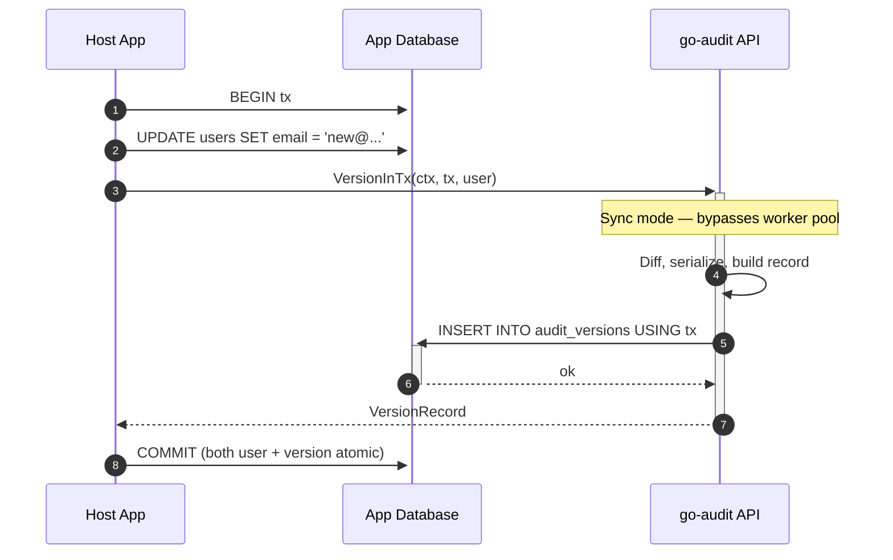

---

## 8. Schema Ownership

### 8.1 Why the Library Owns the Schema

**The library ships all DDL, indexes, partitions, and migrations. Teams never write SQL for version data.** This is a deliberate design decision (ADR-007).

```
┌───────────────────────────────────────────────────┐
│ Team's code                                       │
│                                                   │
│   auditor.Version(ctx, myUser)       ← Write      │
│   auditor.GetVersion(ctx, ...)       ← Read       │
│   // No SQL, no tables, no DDL                    │
└────────────────────┬──────────────────────────────┘
                     │ Go function calls only
                     ▼
┌───────────────────────────────────────────────────┐
│ Library internals (teams never touch this)         │
│                                                   │
│   INSERT INTO audit_versions (...)                │
│   SELECT * FROM audit_versions WHERE ...          │
│   Auto-created indexes, partitions, projections   │
└───────────────────────────────────────────────────┘
```

**Why?** A missing composite index turns 1ms queries into 500ms table scans. Wrong ClickHouse `ORDER BY` turns 3ms queries into 100ms column scans. Teams don't have deep OLAP schema expertise — and shouldn't need it for an audit library.

All entities share **one table** (`audit_versions`), discriminated by `entity_type`. Entity data is serialized as JSON/MsgPack into a `data BYTEA` column. This is a well-known **single-table audit log pattern**.

### 8.2 OLTP Schema

Created by `audit.AutoMigrate(db)`:

```sql
CREATE TABLE IF NOT EXISTS audit_versions (
    id              TEXT        PRIMARY KEY,        -- ULID
    entity_type     TEXT        NOT NULL,
    entity_id       TEXT        NOT NULL,
    version         BIGINT      NOT NULL,
    strategy        SMALLINT    NOT NULL,           -- 0=Full, 1=Delta, 2=Hybrid
    schema_version  INTEGER     NOT NULL DEFAULT 1,
    data            BYTEA       NOT NULL,           -- Serialized entity/delta
    content_type    TEXT        NOT NULL DEFAULT 'application/json',
    previous_hash   TEXT,
    hash            TEXT,
    metadata        JSONB       NOT NULL,
    created_at      TIMESTAMPTZ NOT NULL DEFAULT NOW(),

    CONSTRAINT uq_entity_version UNIQUE (entity_type, entity_id, version)
);

-- Indexes that make point queries 1-5ms
CREATE INDEX idx_audit_versions_entity_latest
    ON audit_versions (entity_type, entity_id, version DESC);
CREATE INDEX idx_audit_versions_actor
    ON audit_versions ((metadata->>'actor_id'), created_at DESC);
```

### 8.3 OLAP Schema

ClickHouse schema is optimized for **both** point queries and analytics — the single most important design decision:

```sql
CREATE TABLE audit_versions (
    -- ... same columns as OLTP ...
) ENGINE = MergeTree()
PARTITION BY toYYYYMM(created_at)
PRIMARY KEY (entity_type, entity_id, version)
ORDER BY (entity_type, entity_id, version, created_at)
SETTINGS index_granularity = 512;
```

**Why this ORDER BY matters:**

| Query | Naive Schema | Library Schema |
|-------|-------------|---------------|
| GET user_123 version 42 | 50–200ms ❌ | 3–15ms ✅ |
| LIST versions of user_123 | 20–150ms | 5–25ms ✅ |
| COUNT changes last 90 days | 100–500ms | 100–500ms (same) |

`index_granularity = 512` (not default 8192) trades ~2x index memory for 5–10x faster point queries. The library also creates projections for time-range and actor-based queries that ClickHouse auto-selects per query.

### 8.4 Schema Evolution

When a team's Go struct evolves, the library provides a migration framework so **old versions remain readable**:

```go
auditor.RegisterMigration("user", 1, 2, func(old map[string]interface{}) map[string]interface{} {
    old["full_name"] = old["first_name"].(string) + " " + old["last_name"].(string)
    delete(old, "first_name")
    delete(old, "last_name")
    return old
})
```

Key properties:
- **Lazy** — migrations applied on read, not backfilled
- **Forward-only** — no rollback. Old code reads old schema versions fine
- **Verified at registration** — gaps (v1→v3 without v2) are rejected
- **Auto-detected** — library fingerprints struct fields; changes bump `schema_version`

---

## 9. Write-Ahead Log (WAL)

In BackgroundMode, `Version()` returns in ~1ms by enqueuing work to an in-memory channel. If the process crashes before the worker persists, that version is lost. The WAL closes this gap.

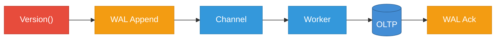

**On crash recovery** (startup): Replay un-acked WAL entries → re-submit to worker pool → OLTP's UNIQUE constraint prevents duplicates.

**Three WAL adapters** — pick the one that fits your deployment:

| Adapter | Mechanism | Latency | Best For |
|---------|-----------|---------|----------|
| **NoopWAL** (default) | Nothing — process-durable only | +0ms | Most services |
| **FileWAL** | `fsync` to local file | +0.3–0.5ms | VMs, K8s with PersistentVolumes |
| **DBWALAdapter** | INSERT into OLTP staging table | +3–8ms | Serverless, ephemeral, multi-pod |

```go
// Default — no WAL
auditor := audit.New(audit.Config{DB: db})

// FileWAL — crash-durable, needs local disk
auditor := audit.New(audit.Config{DB: db, EnableWAL: true})

// DBWALAdapter — crash-durable, no local disk needed
auditor := audit.New(audit.Config{DB: db, EnableWAL: true, WALAdapter: "db"})
```

---

## 10. Entity Guardrails

The library owns the schema — but can't control what teams put INTO it. A 10MB `[]byte` field or a struct with 500 tracked fields will degrade performance. The library protects itself with three layers:

**Layer 1: Registration-Time Analysis (Shift-Left)**

```go
auditor.Register(&User{})
// → WARNING: Field 'ProfilePicture' is []byte — add version:"ignore" or set MaxEntitySizeBytes
// → WARNING: Entity 'User' has 247 fields — diff cost grows linearly
```

**Layer 2: Hard Limits (Runtime Safety Net)**

| Limit | Default | Rationale |
|-------|---------|-----------|
| `MaxEntitySizeBytes` | 5MB | 5MB × 100 versions = 500MB per entity |
| `MaxMetadataSizeBytes` | 256KB | Metadata is for audit context, not payloads |
| `MaxFieldCount` | 500 | Diff cost is O(fields) |

```go
pending, err := auditor.Version(ctx, hugeEntity)
// err = audit.ErrEntityTooLarge{Size: 12MB, Limit: 5MB}
```

**Layer 3: Runtime Metrics (Continuous Feedback)**

OTEL histograms for `audit.entity.snapshot_bytes`, `audit.entity.field_count`, `audit.entity.diff_duration`, plus counters for warnings and rejections.

---

## 11. Non-blocking Pipeline

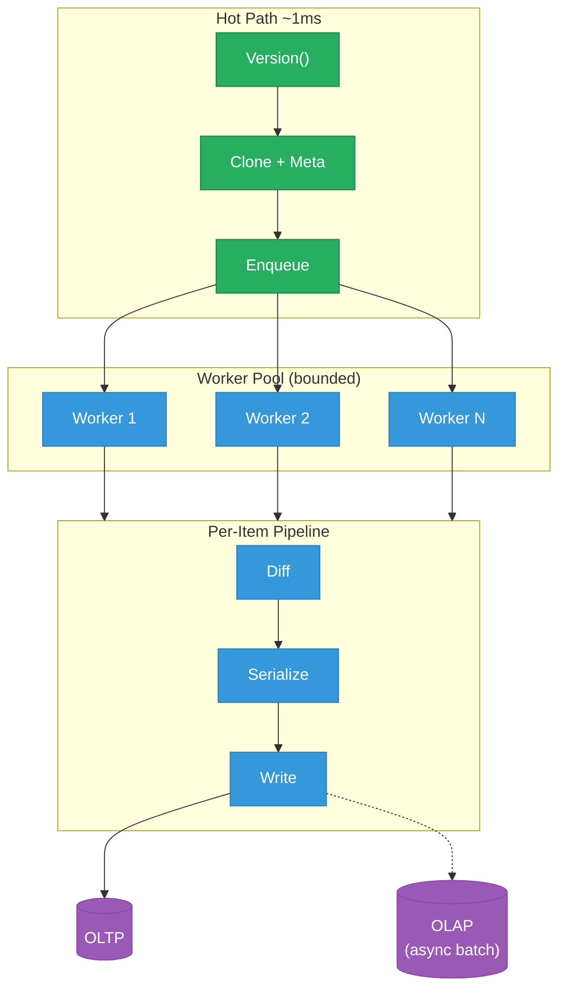

| Mode | Hot Path | Throughput | Durability |
|------|---------|------------|------------|
| BackgroundMode (default) | ~1ms | ~50,000/sec | Process-durable |
| BackgroundMode + FileWAL | ~1.5ms | ~40,000/sec | Crash-durable |
| BackgroundMode + DBWALAdapter | ~4–9ms | ~5,000/sec | Crash-durable, multi-pod |
| SyncMode (VersionInTx) | 8–29ms | ~500/sec | Transaction-durable |

---

## 12. Failure Modes & Resilience

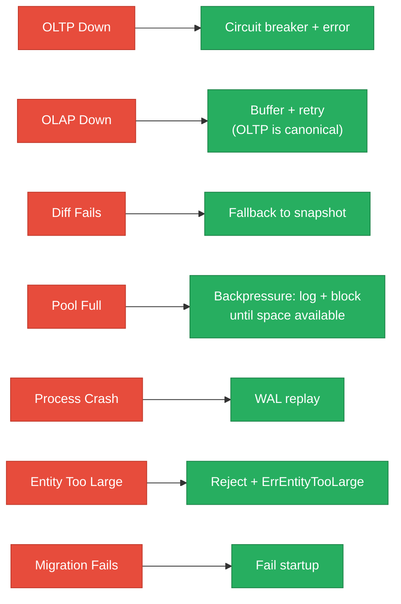

**Resilience guarantees:**

1. Library never panics — all user hook panics are recovered
2. Library never blocks indefinitely — configurable timeouts everywhere
3. Library never leaks goroutines — `Shutdown(ctx)` drains the pool
4. Library never corrupts caller state — entity deep-copied before processing
5. Library fails startup on schema issues — don't run with a broken schema

---

## 13. Observability

OTEL is a **separate Go module** (`go-audit/otel`) — zero dependency in core. The `InstrumenterPort` interface enables any observability backend.

**Key metrics:**

| Metric | Type | Description |
|--------|------|-------------|
| `audit.version.created` | Counter | Versions created |
| `audit.version.duration` | Histogram | Version creation time |
| `audit.version.queue_depth` | Gauge | Worker pool queue depth |
| `audit.diff.computed` | Counter | Diffs computed |
| `audit.diff.fallback` | Counter | Diff fallbacks to snapshot |
| `audit.store.write.duration` | Histogram | Storage write latency |
| `audit.store.cache.hit` / `.miss` | Counter | Cache hit/miss rate |
| `audit.store.olap.batch_size` | Histogram | OLAP batch flush size |
| `audit.wal.append` / `.ack` / `.recovered` | Counter | WAL lifecycle |
| `audit.entity.snapshot_bytes` | Histogram | Snapshot size by entity type |
| `audit.subscriber.ok` / `.error` | Counter | Subscriber results |
| `audit.schema.migration` | Counter | Migrations applied |

**Health check** for Kubernetes/orchestrator probes:

```go
func healthHandler(w http.ResponseWriter, r *http.Request) {
    status := auditor.HealthCheck(r.Context())
    // Checks: OLTP ping, OLAP ping (if configured), Cold (if configured), WAL (if enabled)
    if !status.Healthy {
        w.WriteHeader(http.StatusServiceUnavailable)
    }
    json.NewEncoder(w).Encode(status)
}
```

---

## 14. Security

| Layer | Mechanism |
|-------|-----------|
| **Input** | Entity validation (size + field limits), metadata sanitization |
| **Processing** | Parameterized queries only, no credentials in logs |
| **Storage** | TLS in transit, field redaction for GDPR |
| **Access** | Authorization hooks (BeforeRead/BeforeWrite), multi-tenancy via tenant ID in metadata |

---

## 15. Package Layout

```
go-audit/
├── audit.go                    # Public API: New(), Version(), Query(), AutoMigrate()
├── config.go                   # Config struct
├── context.go                  # WithActor(), WithReason(), WithCorrelationID()
│
├── domain/                     # ═ DOMAIN CORE — Zero infrastructure imports ═
│   ├── types.go                # VersionRecord, Metadata, Delta, Strategy
│   ├── errors.go               # Typed errors
│   ├── version/                # Version creation orchestrator, strategy, sequencing
│   ├── diff/                   # Struct comparison, normalization, fallback
│   ├── reconstruct/            # State reconstruction, compaction, schema migration
│   ├── integrity/              # Hash chain
│   ├── registry/               # Entity type registry, guardrails
│   └── hooks/                  # Before/After hooks, filters
│
├── domain/port/                # ═ PORT INTERFACES — Domain types only ═
│   ├── writer.go               # VersionWriterPort
│   ├── reader.go               # VersionReaderPort
│   ├── cache.go                # CachePort
│   ├── olap.go                 # OLAPPort
│   ├── coldstore.go            # ColdStorePort
│   ├── wal.go                  # WALPort
│   ├── serializer.go           # SerializerPort
│   ├── differ.go               # DifferPort
│   └── ...                     # ClonerPort, InstrumenterPort, SubscriberPort, etc.
│
├── adapter/                    # ═ ADAPTERS — Implement ports ═
│   ├── postgres/               # VersionWriterPort + VersionReaderPort + Schema
│   ├── mysql/                  # Same ports, MySQL dialect
│   ├── clickhouse/             # OLAPPort + batch buffer
│   ├── cache/lru.go            # CachePort (LRU)
│   ├── wal/                    # file.go (FileWAL), db.go (DBWALAdapter), noop.go
│   ├── serializer/             # json.go, msgpack/ (separate go.mod)
│   ├── differ/struct.go        # StructDiffer
│   ├── cloner/                 # reflect.go (default), gen/ (codegen opt-in)
│   ├── metadata/               # context.go, http.go, grpc.go
│   ├── subscriber/             # fanout.go, log.go (default LogSubscriber)
│   └── cold/                   # s3.go, gcs.go (separate go.mod)
│
├── adapter/otel/               # SEPARATE GO MODULE — no OTEL dep in core
│
├── app/                        # ═ APPLICATION LAYER — Wires adapters to ports ═
│   ├── wire.go                 # Dependency injection
│   ├── pool.go                 # Worker pool
│   ├── router.go               # Storage router (OLTP → OLAP → Cold)
│   └── migrate.go              # Migration coordinator
│
├── testing/                    # In-memory adapters, helpers, time mocking
└── examples/                   # simple/, recommended/, otel/, transaction/, wal/
```

**Dependency enforcement:**

| Package | Can Import | Cannot Import |
|---------|------------|---------------|
| `domain/` | Go stdlib only | `adapter/`, `app/`, `database/sql` |
| `domain/port/` | `domain/` types | `adapter/`, `app/` |
| `adapter/*` | `domain/`, `domain/port/`, external libs | Other adapters |
| `app/` | Everything | — (outermost layer) |

---

## 16. Architecture Decision Records

### ADR-001: Single Responsibility — Version & Audit Only

The library does one job. It does not provide HTTP/gRPC endpoints, implement authorization, replace event sourcing, or bundle DB drivers in core.

### ADR-002: OTEL as Plugin, Not Built-in

OTEL lives in `go-audit/otel` — a separate Go module. Core depends on `InstrumenterPort` interface. `NoopInstrumenter` is default (zero cost). No OTEL version conflicts with host app.

### ADR-003: Interface-First Design

15 port interfaces (3 inbound + 12 outbound). Every infrastructure concern is swappable. Domain core is pure Go + stdlib. All ports follow `*Port` suffix naming.

### ADR-004: Context-Driven Metadata

All audit metadata via `context.Context`. Helper functions: `WithActor()`, `WithReason()`, `WithCorrelationID()`, `WithCustomMetadata()`.

### ADR-005: Diff Engine with Graceful Degradation

If diff fails → fall back to full snapshot + log warning. Never persist a delta that can't be reconstructed. Validation runs in worker pool, not hot path.

### ADR-006: Two Storage Profiles

**Simple** (OLTP only) and **Recommended** (OLTP + ClickHouse + S3/GCS). Library owns all DDL. No arbitrary `VersionStore` implementations. Teams pass `*sql.DB` connections. Fewer choices = faster adoption.

### ADR-007: Library Owns Schema DDL and Migrations

The library ships all DDL as embedded Go code. `AutoMigrate(db)` creates tables, indexes, partitions, projections. A missed index = 10–100x performance degradation. Teams never write DDL for audit data.

### ADR-008: Hash Chain Integrity (Opt-in)

Opt-in via `EnableHashChain = true`. SHA-256 default. ~1ms per write. Serializes writes per entity.

### ADR-009: Serialization Strategy

JSON default. MsgPack optional (separate module). No Protobuf — adds dependency for marginal gain. `ContentType` field enables format migration.

### ADR-010: Error Philosophy

Typed errors with categories (`ErrStorage`, `ErrDiff`, `ErrValidation`, `ErrEntityTooLarge`, `ErrWAL`, etc.). Caller decides handling.

### ADR-011: Non-blocking Core Pipeline

BackgroundMode is default. Hot path: clone → WAL append (opt-in) → enqueue (~1ms). Worker pool handles diff + serialize + write. AsyncMode removed — worker pool handles 50K writes/sec without external queue.

### ADR-012: OLAP Schema Optimized for Point Queries

`ORDER BY (entity_type, entity_id, version, created_at)`, `PRIMARY KEY (entity_type, entity_id, version)`, `index_granularity = 512`. Point queries 3–15ms vs 50–200ms naive.

### ADR-013: VersionSubscriber — Post-Write Notification

`VersionSubscriber` interface with `OnVersion(ctx, record) error`. Async, fire-and-forget, failure-isolated. Ships `LogSubscriber` as default. Teams implement for Kafka, webhooks, SNS. No guaranteed delivery — subscribers own retry/DLQ.

### ADR-014: Hexagonal Architecture

Domain core has zero adapter deps. Ports defined in `domain/port/`. Adapters implement ports. Dependency: Adapters → Ports → Domain (never reversed). Testable with zero infrastructure.

### ADR-015: Write-Ahead Log for Crash Durability

Opt-in WAL via `WALPort` with three adapters: NoopWAL (default, zero overhead), FileWAL (local `fsync`, +0.3–0.5ms), DBWALAdapter (OLTP staging table, +3–8ms, works without local disk). Idempotent replay on startup.

### ADR-016: Entity Size Guardrails

Three layers: registration-time analysis (warnings, promotable to errors), hard limits (5MB entity, 256KB metadata, 500 fields), runtime OTEL metrics. Protects the library from entity misuse.

---

## 17. Open Decisions

| # | Question | Options | Leaning |
|---|----------|---------|---------|
| 1 | Library name | `go-audit`, `versionkit`, `auditlog` | `go-audit` |
| 2 | Default diff algorithm | Recursive struct walk vs `reflect.DeepEqual` | Recursive walk |
| 3 | Hot/warm threshold | 90 days vs 180 days | 90 days |
| 4 | License | Apache 2.0 vs MIT | Apache 2.0 |
| 5 | Min Go version | 1.21 vs 1.22 | 1.21 |
| 6 | Version number type | `int64` vs `string` (ULID) | `int64` |
| 7 | Worker pool default | Configurable, default `NumCPU()*2` | Confirmed |
| 8 | Backpressure | Block, drop, switch to sync, callback | Block + callback (log/metrics) |
| 9 | MySQL support | Full parity vs PostgreSQL-first | PostgreSQL-first |
| 10 | FR11 Relationships | Cascade/reference/snapshot + `VersionGroup()` | Defer to Phase 3 |
| 11 | Schema evolution detection | Field fingerprinting vs explicit version | Field fingerprinting |

---

## Appendix A: Version Record Schema

```go
type VersionRecord struct {
    ID            string          `json:"id"`             // ULID
    EntityType    string          `json:"entity_type"`
    EntityID      string          `json:"entity_id"`
    Version       int64           `json:"version"`        // Monotonic
    Strategy      Strategy        `json:"strategy"`       // Full, Delta, Hybrid
    SchemaVersion int             `json:"schema_version"`
    Data          []byte          `json:"data"`           // Serialized entity/delta
    ContentType   string          `json:"content_type"`
    PreviousHash  string          `json:"previous_hash"`  // Optional
    Hash          string          `json:"hash"`
    Metadata      VersionMetadata `json:"metadata"`
    CreatedAt     time.Time       `json:"created_at"`
}

type VersionMetadata struct {
    ActorID       string            `json:"actor_id"`
    ActorType     ActorType         `json:"actor_type"`     // Human, System, API
    Reason        string            `json:"reason"`
    CorrelationID string            `json:"correlation_id"`
    TraceID       string            `json:"trace_id"`
    SpanID        string            `json:"span_id"`
    Source        string            `json:"source"`
    Custom        map[string]string `json:"custom"`
}

type PendingVersion struct {
    Wait(ctx context.Context) (VersionRecord, error)
    Version() int64
    Done() <-chan struct{}
}
```

---

## Appendix B: Quick-Start Examples

### Simple Profile

```go
func main() {
    db, _ := sql.Open("postgres", "postgres://...")

    audit.AutoMigrate(db)
    auditor := audit.New(audit.Config{DB: db})
    defer auditor.Shutdown(context.Background())

    auditor.Register(&User{})

    ctx := audit.WithActor(context.Background(), "admin-1", audit.ActorHuman)
    ctx = audit.WithReason(ctx, "Updated profile")

    user := User{ID: "u-123", Name: "Alice", Email: "alice@example.com"}
    pending, _ := auditor.Version(ctx, user)

    // Business logic continues immediately (~1ms)
    record, _ := pending.Wait(ctx) // Optional: wait for persistence
    _ = record
}
```

### Recommended Profile

```go
func main() {
    db, _ := sql.Open("postgres", "postgres://...")
    chDB, _ := sql.Open("clickhouse", "clickhouse://...")
    s3Store := cold.NewS3("my-audit-bucket", "us-east-1")

    audit.AutoMigrate(db, audit.WithOLAP(chDB))

    auditor := audit.New(audit.Config{
        DB:        db,
        OLAP:      chDB,
        ColdStore: s3Store,
    })
    defer auditor.Shutdown(context.Background())

    auditor.Register(&Order{})

    ctx := audit.WithActor(context.Background(), "system", audit.ActorSystem)
    order := Order{ID: "ord-456", Amount: 99.99, Status: "pending"}
    auditor.Version(ctx, order)
}
```

### With WAL (Crash Durability)

```go
// FileWAL — VMs, K8s with PersistentVolumes
auditor := audit.New(audit.Config{
    DB: db, EnableWAL: true,
})

// DBWALAdapter — Serverless, ephemeral containers, multi-pod
auditor := audit.New(audit.Config{
    DB: db, EnableWAL: true, WALAdapter: "db",
})
```

---

## Appendix C: Testing Support

The library ships an in-memory adapter bundle — no database needed for unit tests.

```go
import audittest "github.com/abhipray-cpu/go-audit/testing"

func TestUserVersioning(t *testing.T) {
    auditor := audittest.NewAuditor(t)  // All ports backed by in-memory implementations
    defer auditor.Shutdown(context.Background())

    auditor.Register(&User{})

    ctx := audit.WithActor(context.Background(), "test-user", audit.ActorHuman)
    user := User{ID: "u-1", Name: "Alice", Email: "alice@test.com"}
    pending, err := auditor.Version(ctx, user)
    require.NoError(t, err)

    record, err := pending.Wait(ctx)
    require.NoError(t, err)
    assert.Equal(t, int64(1), record.Version)
}
```

**Assertion helpers:**

```go
helper := audittest.NewHelper(t, auditor)
helper.AssertVersionCount("user", "u-1", 2)
helper.AssertFieldChanged("user", "u-1", 2, "Email", "old@test.com", "new@test.com")
helper.AssertActorIs("user", "u-1", 2, "admin")
```

**Time mocking:**

```go
clock := audittest.NewMockClock(time.Date(2026, 1, 1, 0, 0, 0, 0, time.UTC))
auditor := audittest.NewAuditor(t, audittest.WithClock(clock))
clock.Advance(24 * time.Hour)
```

---

## Appendix D: Gap Analysis

| Req | Description | Status | Notes |
|-----|-------------|--------|-------|
| FR1 | Simple Integration API | ✅ | `audit.New(Config{DB: db})`, `Version(ctx, entity)` |
| FR2 | Flexible Entity Registration | ✅ | `Register(&User{})`, field tags, per-entity config |
| FR3 | Multiple Versioning Strategies | ✅ | Full / Delta / Hybrid, per-entity |
| FR4 | Pluggable Storage Backends | ✅ | PostgreSQL, MySQL, ClickHouse, S3/GCS |
| FR5 | Intelligent Diff Engine | ✅ | StructDiffer, nested JSON, graceful degradation |
| FR6 | Metadata Capture System | ✅ | Context-based, extractors, middleware helpers |
| FR7 | Query & Reconstruction API | ✅ | 8 query methods including FindChanges, FindByActor, GetBulkAtTime |
| FR8 | Async Processing | ✅ | BackgroundMode + SubscriberPort |
| FR9 | Transaction Integration | ✅ | `VersionInTx(ctx, tx, entity)` |
| FR10 | Schema Evolution | ✅ | `RegisterMigration()`, lazy on-read, `schema_version` |
| FR11 | Relationships & Cascade | ⏳ | Deferred to Phase 3 (v1.0) |
| FR12 | Compliance & Audit | ✅ | Immutability, hash chain, redaction, retention |
| FR13 | Testing Support | ✅ | In-memory bundle, TestHelper, MockClock |
| FR14 | Observability | ✅ | OTEL plugin, 24+ metrics, HealthCheckPort |
| NFR1–3 | Performance | ✅ | ~1ms hot path, LRU cache, worker pool, compaction |
| NFR4–6 | Reliability | ✅ | WAL, circuit breaker, delta validation, panic recovery |
| NFR7–9 | Usability | ✅ | Zero-config startup, typed errors, examples |
| NFR10–14 | Compatibility & Extensibility | ✅ | Go 1.21+, 15 ports, hexagonal architecture |
| NFR15–20 | Security & Operations | ✅ | Parameterized queries, health checks, graceful shutdown |
